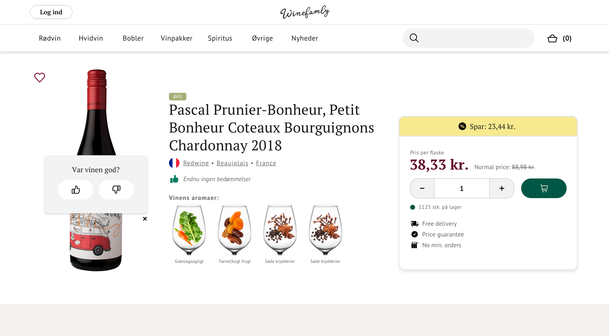

# Winefamly - Rate Wine Test

## Hello again! 👋

I have made a small assignment for you, to show some of your skills in the field of following a design, and making it work across devices and browsers.

To best immitate a normal workday, please use no more than a days worth of work, on this assignment.

## The assignment

The assignment is to create a page from the designs in `/design` folder. The only functionality I am looking for, is the box for rating the wine, but it doesn't need to save the data anywhere.

**Functionality flow**
1. User clicks either thumbs up, or thumbs down
2. Box changes and prompts users to enter a comment
3. After submit, display a success message

## Where to find everything

The designs are in PNG static format. This will mean that you'll need to use your best judgment for styles such as `font-size`, `padding` and `margin`.

You will find all the required assets in `cdn-sources.md` file.

There is also a `style-guide.md` file, which contains the information you'll need, such as color palette, generel spacing rules, and fonts.

## Building your project

Feel free to use any workflow and technology that you feel comfortable with.

When finished, upload to a public repository on [GitHub](https://github.com/), and email me the link @ [stl@winefamly.com](mailto:stl@winefamly.com).

## Deadline
I would like to have your submission by Wednesday the 2nd of December

**Have fun building!** 🚀
